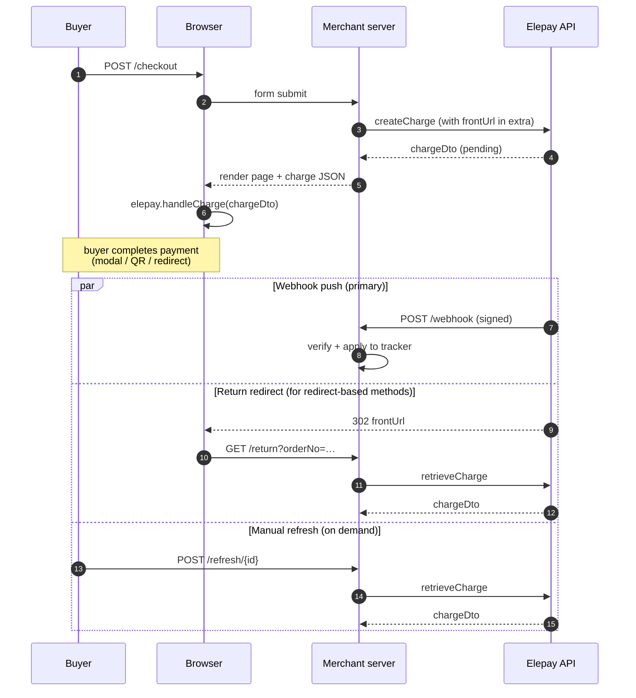

# elepay-java-sdk quickstart (Spring Boot)

A runnable Spring Boot app that drives the SDK against the real elepay test
environment end-to-end:

1. **Server creates a charge** with the Java SDK (`ChargeApi.createCharge`).
2. **Browser pays via elepay.js** — the charge object is handed off to
   `elepay.handleCharge(...)` which renders the hosted payment UI.
3. **Status propagates back** via three complementary paths:
   - **Webhook (primary).** elepay POSTs the signed event to `/webhook`; the
     handler verifies with `Webhook.verifyHeader` and updates the charge record.
   - **`frontUrl` return.** For redirect-based methods the buyer lands back on
     `/return?orderNo=…`, which reconciles the status with one
     `retrieveCharge` call — so the UI reflects reality the instant the user
     is back.
   - **Manual refresh.** A **Refresh** button on each row calls
     `retrieveCharge` on demand. Useful when neither of the two above fired
     (e.g. no webhook endpoint configured, no `frontUrl` round-trip).

   No background polling loop. Polling-per-charge is a demo anti-pattern; in
   production you rely on webhooks and occasional reconciliation.

Pages:

- **`/`** — create-charge form; shows the most recent charges with live status
  and a Refresh button.
- **`/events`** — timeline of webhook deliveries and status transitions;
  auto-refreshes every 5s.

## End-to-end flow



## Setup

1. Install the SDK to your local Maven repository:

   ```bash
   # from the SDK repo root
   mvn -DskipTests install
   ```

2. Copy the config template and fill in your keys:

   ```bash
   cd samples/quickstart
   cp src/main/resources/application.yaml.example \
      src/main/resources/application.yaml
   ```

   - `elepay.secret-key` — a `sk_test_...` from the elepay dashboard
   - `elepay.publishable-key` — the matching `pk_test_...`; handed to the browser so `elepay.js` can call `handleCharge`
   - `elepay.webhook-signing-secret` — the `whsec_...` / `ws_test_...` from the registered webhook endpoint

   `application.yaml` is `.gitignore`'d so the real keys stay local.

## Run

```bash
mvn -q spring-boot:run
# open http://localhost:8080
```

## Exercising the webhook path

elepay has to be able to POST to your `/webhook` from the public internet. Expose
the local port with a tunnel — e.g. `ngrok http 8080` — then register the HTTPS
tunnel URL (`https://xxx.ngrok.app/webhook`) as a webhook endpoint in the elepay
dashboard. Copy that endpoint's signing secret into `application.yaml`.

Create a charge from `/`, complete payment, and you'll see entries appear in
`/events` — e.g. `type=charge.succeeded` from the webhook, and in the charges
table the row's **Updated** column will flip from `(create)` to `(webhook)` or
`(return)`.
