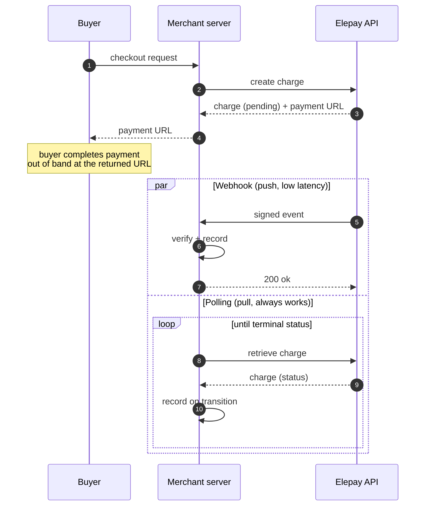

# elepay-java-sdk quickstart (Spring Boot)

A runnable Spring Boot app that drives the SDK against the real elepay test
environment. It ships the two mechanisms we recommend running **in parallel**
so charge state never goes missing:

- **Webhook** — elepay POSTs to `/webhook`, the handler verifies the signature
  with `Webhook.verifyHeader` and records the event.
- **Polling** — every charge created from `/` is tracked by a `@Scheduled`
  background loop that re-queries `retrieveCharge` and records transitions.

Pages:

- **`/`** — create-charge form; shows the latest created charge, the hosted
  checkout URL, and a table of every charge this process is currently polling.
- **`/events`** — unified timeline of webhook deliveries *and* polled
  transitions; auto-refreshes every 5s.

## End-to-end flow



## Setup

1. Install the SDK to your local Maven repository:

   ```bash
   # from the SDK repo root
   mvn -DskipTests install
   ```

2. Copy the config template and fill in your keys:

   ```bash
   cd samples/quickstart
   cp src/main/resources/application.yaml.example \
      src/main/resources/application.yaml
   ```

   - `elepay.secret-key` — a `sk_test_...` from the elepay dashboard
   - `elepay.webhook-signing-secret` — optional; fill in to enable the webhook path

   `application.yaml` is `.gitignore`'d so the real key stays local.

## Run

```bash
mvn -q spring-boot:run
# open http://localhost:8080
```

Tune the polling interval:

```bash
mvn -q spring-boot:run -Dspring-boot.run.jvmArguments="-Dtracker.poll-interval-ms=1500"
```

## Exercising the webhook path

elepay has to be able to POST to your `/webhook` from the public internet. Expose
the local port with a tunnel — e.g. `ngrok http 8080` — then register the HTTPS
tunnel URL (`https://xxx.ngrok.app/webhook`) as a webhook endpoint in the elepay
dashboard. Copy that endpoint's signing secret into `application.yaml`.

Create a charge from `/`, complete payment from the hosted URL, and you'll see
**both** entries appear in `/events`:

- `type=charge.succeeded` — from the webhook
- `poll: ch_... pending -> captured` — from the poller, usually moments later
