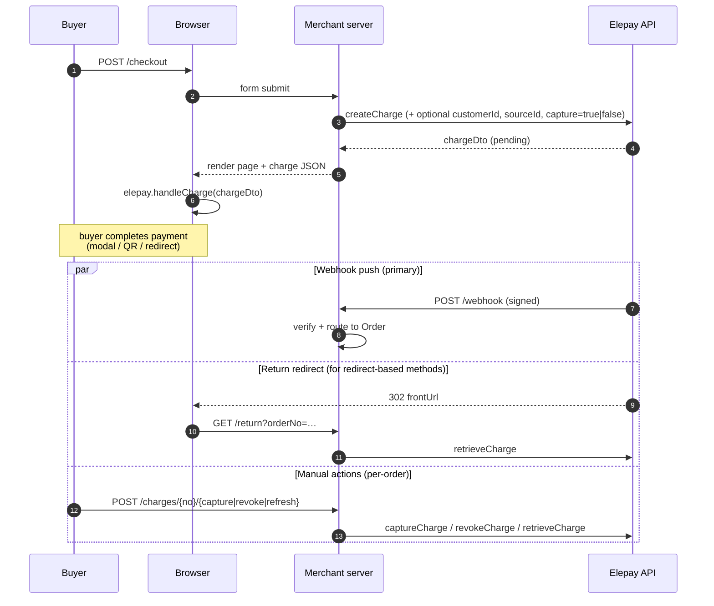

# elepay-java-sdk quickstart (Spring Boot)

A runnable Spring Boot reference application that shows how to use **every
SDK API** behind a **minimal merchant server**. Two in-memory aggregates
(`Customer`, `Order`) tie the pieces together the way a production backend
would.

## What it covers

| SDK API | Pages | Demonstrates |
|---------|-------|--------------|
| `ChargeApi`         | `/` · `/orders` · `/orders/{no}` · `/charges` | create, retrieve, list, capture, revoke, authorize→capture, refund-round-trip |
| `RefundApi`         | on Order detail | createRefund, listChargesRefunds |
| `CustomerApi`       | `/customers` · `/customers/{id}` | customer CRUD **plus** the Source sub-API: create/list/retrieve/delete/retrieveSourceStatus |
| `CodeApi`           | `/codes` · `/orders/{no}` | EasyQR / EasyCheckout createCode/retrieveCode/closeCode, with optional source reuse and `shouldCreateSource` |
| `CodeSettingApi`    | `/diagnostics` | listCodePaymentMethods |
| `SubscriptionApi`   | `/subscriptions` · `/orders/{no}` · `/subscriptions/{no}/periods` | full 8-method flow |
| `DisputeApi`        | `/diagnostics` | listDisputes + retrieveDispute (read-only panel) |
| `PaymentMethodApi`  | `/diagnostics` | listPaymentMethods |
| `TerminalApi`       | `/diagnostics` | listReaders + listLocations (hardware-dependent, usually empty) |
| `Webhook` verifier  | `/webhook` · `/events` | `Webhook.verifyHeader` on raw body; routes events to the matching Order by resource id |
| `elepay.js`         | browser on `/`, `/customers/{id}`, `/orders/{no}` | `handleCharge(chargeDto)` · `handleSource(sourceDto)` · `checkout(codeId)` — server hands the DTO/id to the browser, js-sdk drives the hosted UI |

## Architecture

Four packages, layered so you can scan any controller and find its SDK call
in ~10 lines:

```
io.elepay.quickstart
├── QuickstartApplication        Spring Boot entry point
├── config/                      ElepayProperties + ElepayClientConfig (all API beans)
├── domain/                      merchant aggregates: Customer, Order, OrderType, OrderStatus
├── repository/                  in-memory stores: CustomerRepository, OrderRepository, EventLog
└── web/                         one @Controller per SDK API + WebhookController + ApiExceptionAdvice
```

Dependency direction is strictly downward: `web → repository → domain`,
with `config` providing the SDK beans that controllers inject.

**Finding an SDK call.** Every line that calls into
`io.elepay.client.charge.*` is prefixed with a `// --- elepay SDK ---`
comment. Grep for it:

```bash
grep -rn "elepay SDK" src/main/java
```

### Domain model (in-memory only)

```
Customer (== elepay CustomerDto)
 ├─ sourceIds[]    // SourceDto ids bound via CustomerApi.createSource
 └─ orderNos[]     // merchant orders owned by this customer

Order (the unit of merchant-side business that gets paid)
 ├─ type                 // CHARGE | CODE | SUBSCRIPTION
 ├─ elepayResourceId     // id of the underlying charge/code/subscription
 ├─ customerId           // local Customer.id (also the elepay customer id)
 ├─ businessStatus       // merchant rollup: PENDING/AUTHORIZED/PAID/REFUNDED/CANCELED/FAILED
 ├─ rawStatus            // the verbatim elepay status string (for debugging)
 └─ refunds[]            // RefundDto list, for charge orders
```

A webhook locates the owning Order via `elepayResourceId` — elepay events
reference the resource id, not your merchant orderNo, so that mapping lives
in `OrderRepository.resourceIdToOrderNo`. Unknown resources are recorded
under `<family>.unknown` and otherwise ignored.

State lives in `LinkedHashMap` / `ArrayDeque`; everything clears when the
JVM exits. Swap the repositories for Spring Data JPA (or anything else) to
make it durable — nothing else has to change.

## End-to-end flow (charge)



## Setup

1. Install the SDK to your local Maven repository:

   ```bash
   # from the SDK repo root
   mvn -DskipTests install
   ```

2. Copy the config template and fill in your keys:

   ```bash
   cd samples/quickstart
   cp src/main/resources/application.yaml.example \
      src/main/resources/application.yaml
   ```

   - `elepay.secret-key` — a `sk_test_...` from the elepay dashboard
   - `elepay.publishable-key` — the matching `pk_test_...`; handed to the browser so `elepay.js` can call `handleCharge`
   - `elepay.webhook-signing-secret` — the signing secret of the registered webhook endpoint

   `application.yaml` is `.gitignore`'d.

## Run

```bash
mvn -q spring-boot:run
# open http://localhost:8080
```

## Exercising the webhook path

elepay needs to POST to your `/webhook` from the public internet. Expose
the local port with a tunnel (`ngrok http 8080`) and register the HTTPS URL
(`https://xxx.ngrok.app/webhook`) in the elepay dashboard. Put that
endpoint's signing secret into `application.yaml`.

Every verified event shows up at `/events`, tagged by origin
(`create` / `webhook` / `action` / `refresh` / `reject`) and resource
(`charge.demo-123`, `code.code-456`, …). Unknown event types are recorded
but don't mutate any order state.

## Integration-test checklist

Walk these in order to confirm the SDK is working end-to-end:

- [ ] `/` → create charge with `capture=true` → pay → webhook flips status to `paid`
- [ ] `/` → create charge with `capture=false` → pay → status `uncaptured` → click **captureCharge** → `paid`
- [ ] Order detail → **createRefund** → status `refunded` or `partially_refunded`; webhook arrives
- [ ] Order detail → **revokeCharge** on an `uncaptured` charge → status `revoked`
- [ ] `/customers` → create customer → `/customers/{id}` → attach a source (redirect method) → complete activation → **retrieveSourceStatus** shows `active`
- [ ] `/customers/{id}` → click **charge** on an active source row → completes without re-entering credentials
- [ ] `/codes` → create code → pay via QR → `closeCode` closes any unpaid
- [ ] `/subscriptions` → create → **startSubscription** → status `active` → `/subscriptions/{no}/periods` returns (likely empty)
- [ ] `/charges` → remote `listCharges` paginates
- [ ] `/diagnostics` → all panels open without errors (empty is fine for disputes / readers)
- [ ] `/events` → every step above produced a tagged entry
